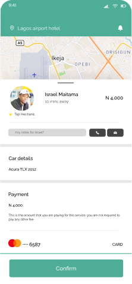
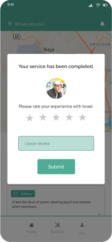
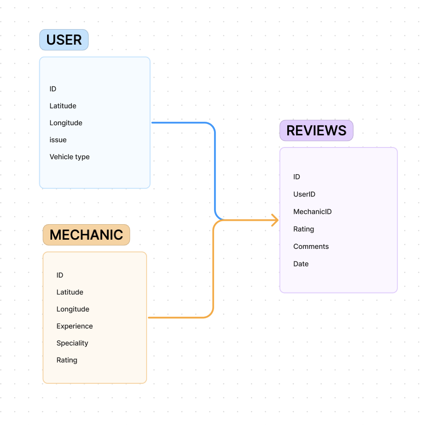

# Project Title
Find-my-mechanic

## Overview

Find-my-mechanic is a product for users who find themselves stranded needing auto-mechanic assistance.

### Problem

About one in three drivers find themselves stranded in an unknown area due to a car breakdown, a situation that can be both unprecedented and stressful. This leaves drivers vulnerable, often facing long hours of waiting for assistance. The uncertainty is compounded by concerns over the trustworthiness and quality of the repair services available. Ensuring reliable help and maintaining peace of mind in such scenarios remains a significant challenge for many motorists.


### User Profile

- Drivers:
    - stranded with a broken down vehicle in an unknown location
    - that want to try fixing their cars on their own, instead of   waiting
    - looking for auto-mobile repair services around them
    - looking to calculate the costs of repair for their vehicle


### Features

- As a user, I want to able to find the closest repair service closest to any given location.
- As a user, I want to able to find the closest repair service closest to my current location.
- As a user, I want to able to find the best quality of repair service closest to any given location.
As a user, I want to able to schedule a repair service closest to any current location.
- As a user, I want to be able to view the cost estimates of repair services for a given issue.
- As a user, I want to be able to view possible self-help options.

- As a user, I want to be able to create an account to view the details of my scheduled services.
- As a user, I want to be able to login in to my account to view the details of my scheduled services.

- As a logged in user, I want to store my vehicle's details for future use.

- As a logged in user, I want to see how far away the repair service is from location.
- As a logged in  user, I want to be able to rate the service of the repair person.
- As a logged in  user, I want to be able to update the rating the service of the repair person.
- As a logged in  user, I want to be able to view my repair history and cost.


## Implementation

### Tech Stack

- React
- MySQL
- Express
- Client libraries: 
    - react
    - react-router
    - axios
- Server libraries:
    - knex
    - express
   

### APIs

Geolocation Api 

### Sitemap

- Home page
- Book a service
- Request Mechanic
- View Mechanic details
- Review mechanic

### Mockups


#### Register Page


#### Home Page


#### Book a service Page


#### Enter Location Page


#### Mechanic details Page


#### Review Page



### Data




### Endpoints

**GET /mechanics**

- Get mechanics info.

Parameters:
- Using service categories to find machanics grouped under a certain service.


Response:
```
[ {
    "id": 1,
      "name": "John's Auto Repair",
      "image_path": "/photo-1.jpg",
      "location": "3 mins way"
      
  },
]
```
**GET /mechanics/:id**

- Get mechanics by id.

Parameters:
- id: mechanics id as number

Response:
```
[ {
    "id": 1,
      "name": "John's Auto Repair",
      "image_path": "/photo-1.jpg",
      "location": "3 mins way"
      
  },
]
```

**GET /mechanics/:id/review**

- Get mechanics reviews by id.

Parameters:
- id: mechanics id as number


Response:
```
[ {
  "id": 1,
  "services_id": 1,
  "reviewer": "Alice",
  "comment": "Quick and efficient service!",
  "rating": 5
  },
]
```


**POST /mechanics/:id/rating**

- Logged in user can add their rating of a mechanic

Parameters:
- id: mechanic id


Response:
```
[ {
    "id": 1,
    "name": "John Doe",
    "specialty": "Engine Repair",
    "rating": 4.8,
    "userRating": 4,
  },
]
```

## Roadmap

- Create client
    - react project with routes and boilerplate pages

- Create server
    - express project with routing, with placeholder 200 responses

- Create migrations

- Gather  sample mechanic information and their locations.

- Create seeds with sample mechanic data

- Deploy client and server projects so all commits will be reflected in production

- Feature: Book a service
    - View list of services, grouped by category
    - Get mechanic based on service
   

- Feature: List mechanics from a given location
    - Implement list mechanics page including location form
    - Store given location in sessionStorage
    - Create GET /mechanics endpoint

- Feature: View mechanic
    - Implement view mechanic page
    - Create GET /n/:id 

- Feature: Review mechanic
    - Add form input to review mechanic
    - Create POST /ratings
    - States for add & update ratings 


- Bug fixes

- DEMO DAY

## Nice-to-haves
- Implement JWT token for user log in
- Integrate Google Places / Maps
    - Self-help funtionality
    - Schedule a service
- Forgot password functionality
- Elite status badging for mechanics.
- Unit and Integration Tests
